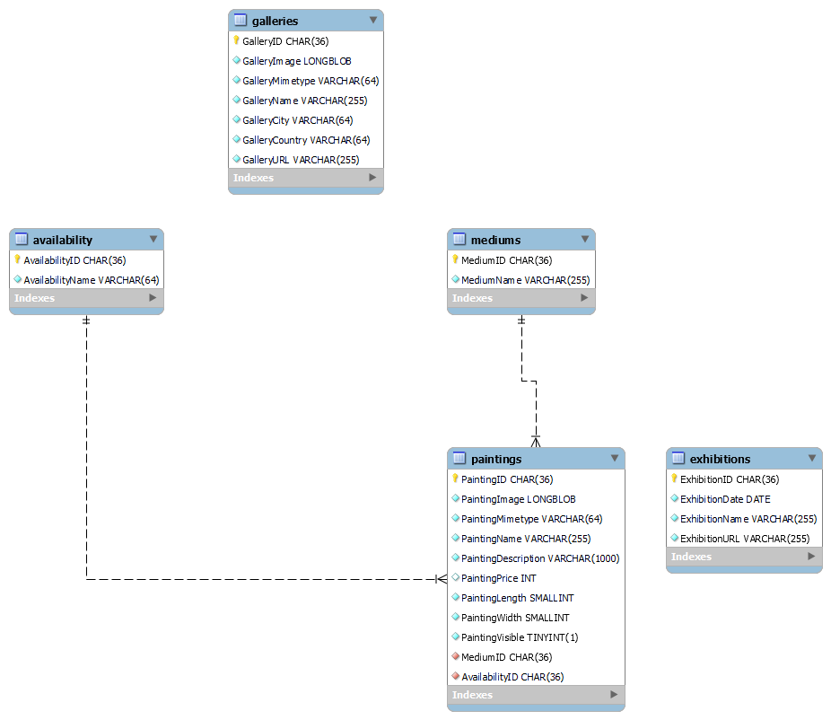

# CS602 Server Side Web Development Final Project
Ryan Bland

4 March 2023

Boston University

---

## Background
This application has been created using Node.js/Express with a MySQL database. It stores information regarding an art website: namely the paintings the artist has created and exhibitions and galleries that the artist is involved with. The front end has been done with Bootstrap.

## Setting up 
First install all dependencies listed in the package.json file.

To replicate this project in your own environment, ensure that MySQL is installed and the service is running. In MySQL, run the initDB.sql file. This will create a cs602 database with a number of tables and the availability/medium tables prefilled. The Painting, Exhibitions, and Galleries tables will be empty. From here, the project can optionally be started to view the website with no data.

The following database schema is used.

**At this point you should ensure that the credentials.js file contains the information needed to connect to the database. It is assumed that the cs602 database will be used with the username "root" with a password of "root". Should you choose to change any of this information, make sure to reflect these changes in the credentials file.**

To load data into the database, run the loadData.js file. This script uses the data in the prefillData folder to execute insert statements on the database. Note that there is not a reference to an image placed in the database, rather the data is saved as a blob. Images will not appear in the public/images folder.

Paintings can be marked as nonvisible, meaning that they can appear in the database and the admin views, but not in the search, display, or detail views. Using the loadData.js file will make everything visible by default.

You can now start the web server, this can be done with either the **nodemon server** command or **npm start**. The application runs on port 3000.

## User Functionality
From here you can open localhost:3000 to go to a static homepage. A typical user would have three possible pages they can visit
1. Paintings
    
    You can view all of the paintings that have been uploaded to the database. You also have the option to filter based on Medium, Availability, and a search term (the search term is used on the name and description of the painting). 

    It is possible to click on a painting to view its details such as price, description, medium, availability etc.
2. Galleries

    Here a list of the galleries uploaded to the database can be viewed. 

3. Exhibitions

    Here a list of exhibitions uploaded to the database can be viewed.

## Admin Functionality
By using the Admin dropdown on the navigation bar, it is possible to add, remove and edit any of the three main subjects. 

* Adding: a form for the corresponding subject will be opened which you will need to complete. Client-side validation is used for the most part. **If you upload your own photo, it must be a jpg! Other file types are not accepted**

* Editing: a form for the specific item will be opened and prefilled with the data already available in the data. From here you can edit and submit the form.

* Deleting: A confirmation screen will be display. Upon confirming, the object will be removed from the database.

## Error Handling
Only three types of errors should be displayed: 404, 410 and 500. 
* If any database query should fail for whatever reason, a 500 error will be displayed. A 500 error can be tested by shutting down the MySQL service and visiting a webpage that relies on database connectivity.
* If you attempt to visit a route that is not defined or use a parameter that is not supported, a 404 error will be displayed. You can test a 404 error by visiting http://localhost:3000/123.
* If you attempt to visit a painting that is not marked as visible, you will receive a 410 error. You can test a 410 error by trying to open the details page of a painting with PaintingVisible = false.

## Classes
Classes are used to quickly transform a database object to a functional object which can be used to retrieve the necessary display information and display the object in JSON or XML along with several formatting methods. The Exhibition, Gallery, and Painting classes inherit from the DatabaseResult object which provides general functionality used across all three objects.

An ErrorHandler class was also made to more easily throw errors to the error page.

## Endpoints
In an actual production environment, the admin routes would be protected by authentication, and it would not be possible to submit post requests unless it is done through the form in the website. 

The publicly accessible endpoints are as follows:
* /paintings
* /paintings/:id
* /paintings?medium=*medium*&availability=*availability*&search=*search term*
    * eg: /paintings?medium=Oil+on+Panel&availability=Available&search=white
    * if medium, availability or search is left empty, the corresponding filter will not be used
    * if all three arguments are left empty, all paintings will be returned
* /exhibitions
* /galleries

You can use the following values in the Accept header:
1. application/json
2. application/xml
3. text/html

There are also 'Admin' endpoints that are used to edit, delete, and add new items. The GET requests to add, delete and edit will bring up a form for adding and editing and a confirmation screen for deleting. Choosing to edit an item will bring up a form similar to the add form, but the form will be prepopulated with the data already in the database. From these pages, a post request can be made to perform the associated action. Each option in the navigation bar will bring the user to the correspondening administration page of the item in which all items can be viewed with their details. 
| Route                         | Method    | File                                          |
|-------------------------------|-----------|-----------------------------------------------|
|/admin/paintings               |GET        |/Admin/Paintings/adminPaintings.js             |
|/admin/paintings/add           |GET        |/Admin/Paintings/addPaintingForm.js            |
|/admin/paintings/add           |POST       |/Admin/Paintings/addPainting.js                |
|/admin/paintings/delete/:id    |GET        |/Admin/Paintings/confirmDeletePainting.js      |
|/admin/paintings/delete/:id    |POST       |/Admin/Paintings/deletePainting.js             |
|/admin/paintings/edit/:id      |GET        |/Admin/Paintings/editPainting.js               |
|/admin/paintings/edit/:id      |POST       |/Admin/Paintings/updatePainting.js             |
|/admin/galleries               |GET        |/Admin/Galleries/adminGalleries.js             |
|/admin/galleries/add           |GET        |/Admin/Galleries/addGalleryForm.js             |
|/admin/galleries/add           |POST       |/Admin/Galleries/addGallery.js                 |
|/admin/galleries/delete/:id    |GET        |/Admin/Galleries/confirmDeleteGallery.js       |
|/admin/galleries/delete/:id    |POST       |/Admin/Galleries/deleteGallery.js              |
|/admin/galleries/edit/:id      |GET        |/Admin/Galleries/editGallery.js                |
|/admin/galleries/edit/:id      |POST       |/Admin/Galleries/updateGallery.js              |
|/admin/exhibitions             |GET        |/Admin/Exhibitions/adminExhibitions.js         |
|/admin/exhibitions/add         |GET        |/Admin/Exhibitions/addExhibitionForm.js        |
|/admin/exhibitions/add         |POST       |/Admin/Exhibitions/addExhibition.js            |
|/admin/exhibitions/delete/:id  |GET        |/Admin/Exhibitions/confirmDeleteExhibition.js  |
|/admin/exhibitions/delete/:id  |POST       |/Admin/Exhibitions/deleteExhibition.js         |
|/admin/exhibitions/edit/:id    |GET        |/Admin/Exhibitions/editExhibition.js           |
|/admin/exhibitions/edit/:id    |POST       |/Admin/Exhibitions/updateExhibition.js         |
